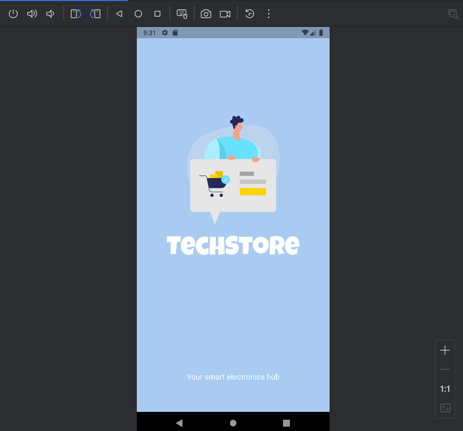
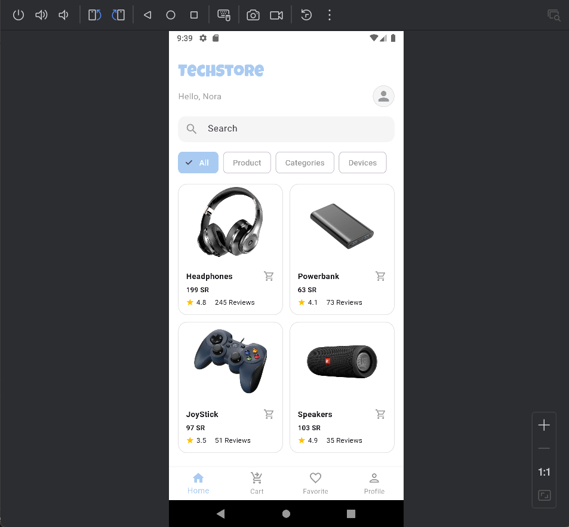
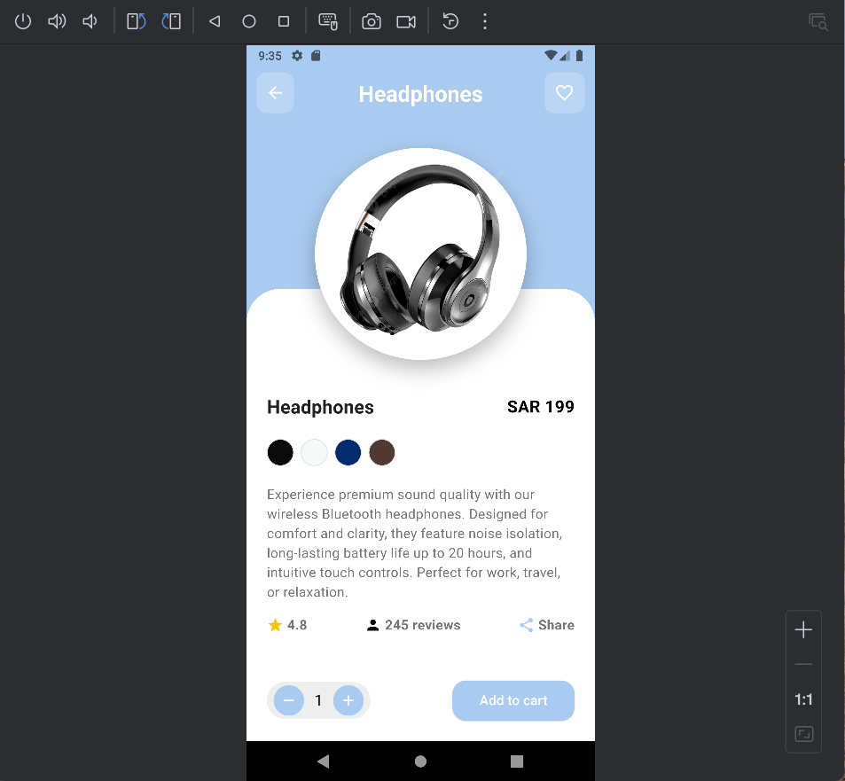
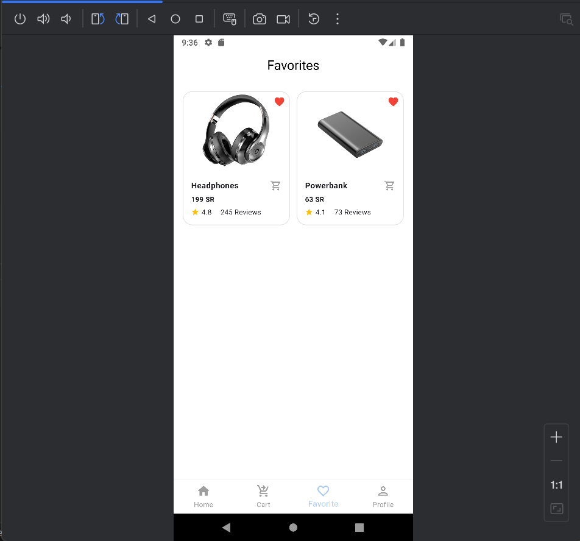
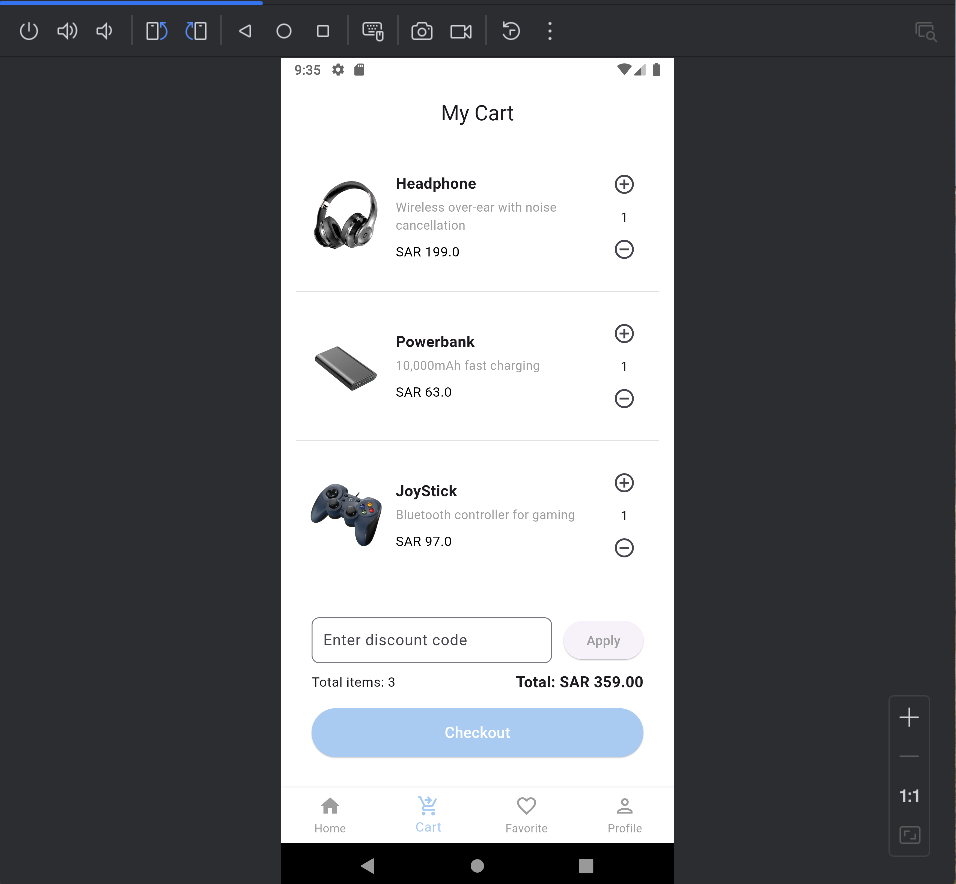
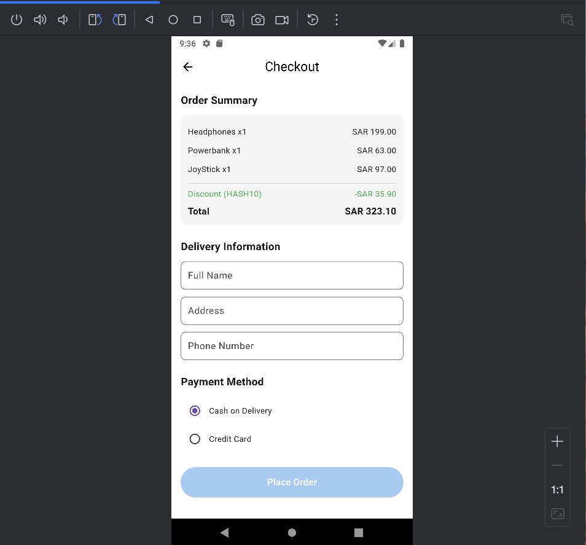
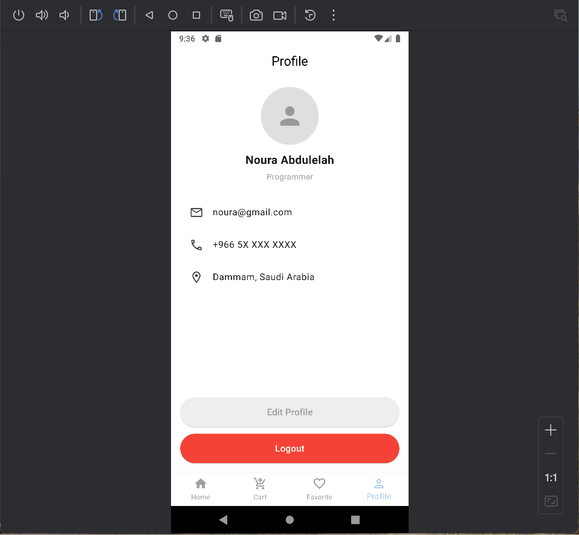

# 🛒 techstore_app

A modern and elegant Flutter-based e-commerce app for browsing and purchasing electronics.  
Designed with a clean UI, smooth navigation, and scalable architecture, ideal for showcasing Flutter development best practices.

## ✨ Features

- 🧭 Intuitive navigation across all screens
- 🛍️ Grid-based product listing with responsive layout
- 📄 Product detail page with image, description, and price
- 🛒 Dynamic shopping cart with item management
- 🔍 Fast product search
- 📱 Responsive design for all screen sizes
- 🧱 Modular codebase with reusable widgets
- 🎞️ Smooth animations for screen transitions

## 📸 Screenshots

| Splash Screen | Home Screen | Product Details |
|---------------|-------------|------------------|
|  |  |  |

| Favorites | Cart | Checkout | Profile |
|-----------|------|----------|---------|
|  |  |  |  |

## 🧠 Tech Stack

- Flutter & Dart
- Clean Architecture principles
- Material Design components

## 🚀 Getting Started

```bash
git clone https://github.com/Nora-Abdulelah/techstore_app.git
cd techstore_app
flutter pub get
flutter run
```
## 📁 Project Structure

```
lib/
├── core/              
├── features/          
│   ├── cart/
│   ├── checkout/
│   ├── favorite/
│   ├── home/
│   ├── product/
│   └── profile/
├── shared/            
└── main.dart
```
---

## 👩‍💻 Developer

**Noura Abdulelah Momenah**  
**Full-stack Web & Mobile Developer**  
Specialized in React, Express, MongoDB, and Flutter  
UI/UX Strategist & Interface Architect  
GitHub: [@Nora-abdulelah](https://github.com/Nora-Abdulelah)